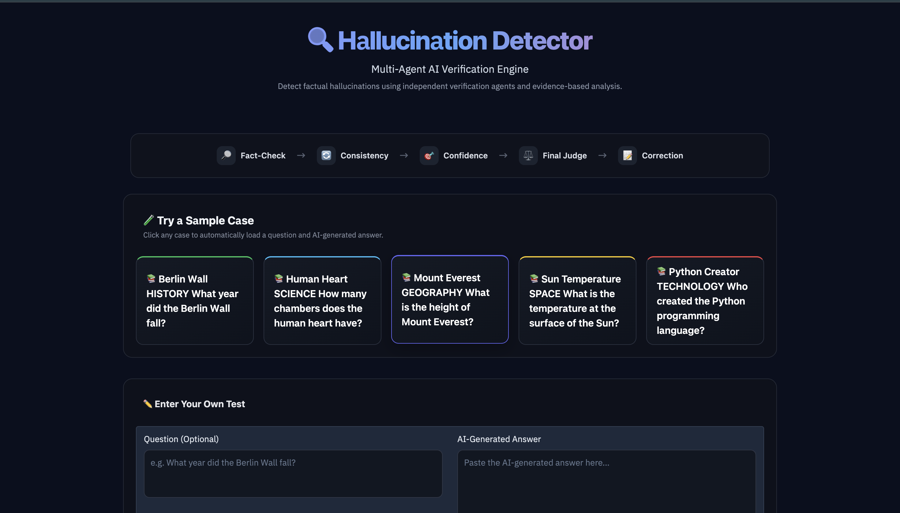
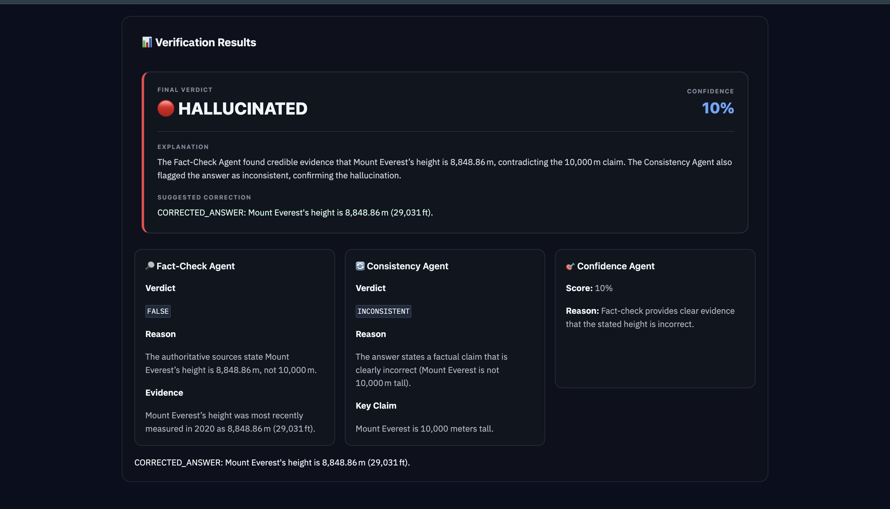
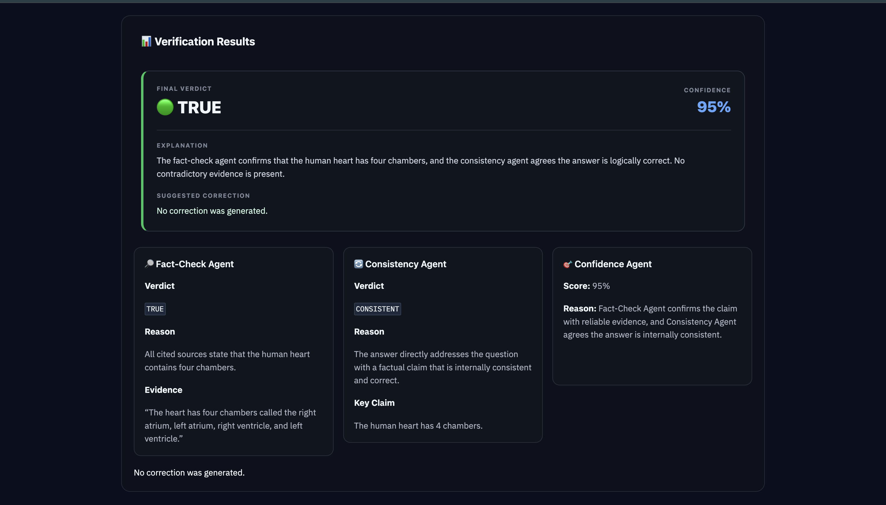

# 🧠 Hallucination Detector


A multi-agent hallucination detection system that evaluates AI-generated answers using independent fact-checking, consistency analysis, confidence scoring, external web evidence, and automatic answer correction.

---

## 🚀 Overview

Large Language Models can generate answers that sound convincing but are factually incorrect.

This project addresses that problem by evaluating an AI-generated answer through multiple specialized agents and external web evidence.

The system combines:

- 🔍 Fact-Checking
- 🔄 Consistency Analysis
- 📊 Confidence Scoring
- ⚖️ Final Verdict Aggregation
- 🔧 Automatic Answer Correction

### System Workflow

```text
User Question
      │
      ▼
AI-Generated Answer
      │
      ▼
┌─────────────────────────┐
│      Orchestrator       │
└────────────┬────────────┘
             │
       ┌─────┼─────┐
       ▼     ▼     ▼
   Fact-   Consistency Confidence
   Check     Agent      Agent
   Agent
       │       │          │
       └───────┼──────────┘
               ▼
       Verdict Aggregation
               │
        ┌──────┴──────┐
        ▼             ▼
   Final Verdict   Correction
                      │
                      ▼
              Corrected Answer
```

---

## ✨ Features

- Multi-agent hallucination detection
- External web evidence verification
- Fact-checking of AI-generated answers
- Consistency analysis
- Confidence scoring from 0–100
- Final verdict aggregation
- `TRUE`, `FALSE`, and `UNCERTAIN` fact-check verdicts
- Entity and context-aware verification
- Handles ambiguous claims
- Handles estimates and numerical ranges
- Web-search failure handling
- Automatic corrected-answer generation
- JSON result logging
- Test question bank
- Automated pytest test suite (44 tests)
- Interactive Gradio interface
- Modular Python architecture

---

## 🧠 Multi-Agent Architecture

### 1. 🔍 Fact-Check Agent

The Fact-Check Agent searches the web for external evidence and compares the AI-generated answer against the retrieved information.

It evaluates:

- Factual support
- Factual contradiction
- Entity matching
- Context
- Ambiguous entities
- Numerical claims
- Estimates
- Ranges
- Incomplete evidence

Possible verdicts:

```text
TRUE
FALSE
UNCERTAIN
```

---

### 2. 🔄 Consistency Agent

The Consistency Agent checks whether the generated answer is internally consistent with the question and its own claims.

It identifies:

- Contradictions
- Logical inconsistencies
- The main claim being made
- Whether the answer directly addresses the question

Possible verdicts:

```text
CONSISTENT
INCONSISTENT
```

---

### 3. 📊 Confidence Agent

The Confidence Agent produces a confidence score representing how confident the system should be that the original AI-generated answer is factually correct.

The score ranges from:

```text
0 ─────────────────────────────── 100
Low                              High
```

The score considers the results from the Fact-Check and Consistency Agents.

---

### 4. ⚖️ Orchestrator

The Orchestrator coordinates the complete hallucination detection pipeline.

It:

1. Receives the question and AI-generated answer
2. Runs the Fact-Check Agent
3. Runs the Consistency Agent
4. Runs the Confidence Agent
5. Aggregates the results
6. Produces the final verdict
7. Saves the detection result
8. Generates a corrected answer when required

---

### 5. 🔧 Re-Prompting Agent

When an answer is identified as hallucinated, the system can re-prompt the LLM using the verification results to generate a corrected answer.

Example:

```text
Question:
What is the capital of Australia?

Original Answer:
The capital of Australia is Sydney.

Final Verdict:
HALLUCINATED

Corrected Answer:
The capital of Australia is Canberra.
```

---

## ⚖️ Verdict System

The Fact-Check Agent uses three possible verdicts.

### ✅ TRUE

Returned when:

- External evidence clearly supports the claim
- The evidence refers to the same entity and context

### ❌ FALSE

Returned when:

- External evidence clearly contradicts the claim
- The evidence refers to the same entity and context

### ⚠️ UNCERTAIN

Returned when:

- Evidence is insufficient
- Evidence is ambiguous
- Sources conflict
- The entity is unclear
- The claim cannot be reliably verified
- Evidence only partially addresses the claim
- The difference is primarily one of precision or estimation

The system intentionally prefers `UNCERTAIN` over making an unjustified `TRUE` or `FALSE` decision.

---

## 🔍 Example

### Incorrect AI Answer

```text
Question:
What is the capital of Australia?

AI Answer:
The capital of Australia is Sydney.
```

The system evaluates the answer using all three agents:

```text
Fact-Check:
FALSE

Consistency:
INCONSISTENT

Confidence:
LOW

Final Verdict:
HALLUCINATED
```

The correction stage can then generate:

```text
The capital of Australia is Canberra.
```

---

## 🌐 Web Verification

The Fact-Check Agent uses `DDGS` to retrieve external web evidence.

The search system includes:

- Normal SSL verification
- SSL fallback
- Retry handling
- Timeout handling
- Duplicate evidence filtering
- Concise evidence extraction
- Graceful search failure handling

If web search is unavailable, the system does not treat the failure as evidence.

Instead, the detector can return:

```text
UNCERTAIN
```

---

## 🖥️ Gradio Interface

The project includes an interactive Gradio interface for running the hallucination detector.

The interface allows users to provide:

- A question
- An AI-generated answer

The system then displays the detection results, including:

- Fact-Check result
- Consistency result
- Confidence score
- Final verdict
- Explanation
- Corrected answer when applicable

### Screenshots

**Home screen — sample cases and custom input:**



**Hallucinated answer detected and corrected:**



**Correct answer verified as true:**



---

## 📁 Project Structure

```text
hallucination-detector/
│
├── agents/
│   ├── __init__.py
│   ├── confidence_agent.py
│   ├── consistency_agent.py
│   ├── fact_check_agent.py
│   ├── orchestrator.py
│   └── reprompt_agent.py
│
├── data/
│   └── results/
│       └── .gitkeep
│
├── tests/
│   ├── __init__.py
│   ├── test_agents.py
│   ├── test_orchestrator.py
│   └── test_result_parser.py
│
├── ui/
│   └── gradio_app.py
│
├── utils/
│   ├── __init__.py
│   ├── get_input.py
│   ├── result_parser.py
│   ├── test_questions.json
│   └── test_questions.py
│
├── .env
├── .gitignore
├── .python-version
├── LICENSE
├── requirements.txt
└── README.md
```

> `.env` is intentionally excluded from GitHub because it contains the Groq API key.

---

## 🛠️ Tech Stack

| Technology | Purpose |
|---|---|
| Python | Core development |
| LangChain | LLM integration |
| Groq | LLM inference |
| GPT-OSS 20B | Reasoning and verification |
| DDGS | Web search |
| Gradio | User interface |
| python-dotenv | Environment variable management |
| pytest | Automated testing |
| JSON | Result storage |

---

## ⚙️ Installation

### 1. Clone the Repository

```bash
git clone https://github.com/Ayush06-coder/hallucination-detector.git
cd hallucination-detector
```

### 2. Create a Virtual Environment

```bash
python -m venv venv
```

### 3. Activate the Environment

#### macOS / Linux

```bash
source venv/bin/activate
```

#### Windows

```bash
venv\Scripts\activate
```

### 4. Install Dependencies

```bash
pip install -r requirements.txt
```

### 5. Configure Environment Variables

Create a `.env` file in the project root:

```env
GROQ_API_KEY=your_groq_api_key
```

Do not commit the `.env` file to GitHub.

---

## ▶️ Running the Project

### Run the Orchestrator

```bash
python -m agents.orchestrator
```

The system will ask for a question and an AI-generated answer.

### Run the Gradio Interface

```bash
python ui/gradio_app.py
```

Alternatively, from the project root:

```bash
python -m ui.gradio_app
```

Either command works. The terminal will display the local Gradio URL — open it in your browser to use the interface.

### Run the Fact-Check Agent

```bash
python agents/fact_check_agent.py
```

Individual agents can also be tested independently.

---

## 📊 Output

Detection results are saved as JSON files inside:

```text
data/results/
```

Example:

```json
{
  "question": "What is the capital of Australia?",
  "answer": "The capital of Australia is Sydney.",
  "final": {
    "verdict": "HALLUCINATED",
    "confidence_score": 95
  }
}
```

Generated result files are excluded from Git tracking.

---

## 🧪 Testing

The project contains a collection of test questions in:

```text
utils/test_questions.json
```

The test questions can be used to evaluate different types of claims, including:

- Correct factual answers
- Incorrect factual answers
- Ambiguous entities
- Numerical claims
- Estimates
- Uncertain predictions

### Automated Test Suite

The project includes a `pytest` suite covering the result parser, all four agents (with mocked LLM calls), and the full orchestrator pipeline, including failure-recovery scenarios.

Run it with:

```bash
pip install -r requirements.txt
python -m pytest tests/ -v
```

44 tests currently pass, covering both expected outputs and graceful degradation when an agent or the LLM call fails.

---

## 🔐 Environment Variables

The project requires:

```env
GROQ_API_KEY
```

The API key should be stored locally in `.env`.

The `.gitignore` configuration prevents `.env` from being committed to the repository.

---

## 🔮 Future Improvements

Potential future improvements include:

- Source credibility scoring
- Multiple independent search engines
- Citation extraction
- Source ranking
- Claim-level verification
- Batch evaluation
- Hallucination benchmark datasets
- Precision, Recall and F1 evaluation
- Improved UI visualizations
- Deployment
- Authentication
- Persistent database storage
- Model comparison

---

## 🎯 Project Goal

The goal of this project is to build a practical and modular system for detecting factual hallucinations in AI-generated responses.

Instead of relying on a single LLM judgment, the system uses multiple specialized agents and external evidence to make a more reliable decision.

---

## 👨‍💻 Author

**Ayush Sawhney**

B.Tech Computer Science Engineering

GitHub:  
https://github.com/Ayush06-coder

---

## 📄 License

This project is licensed under the [MIT License](LICENSE).